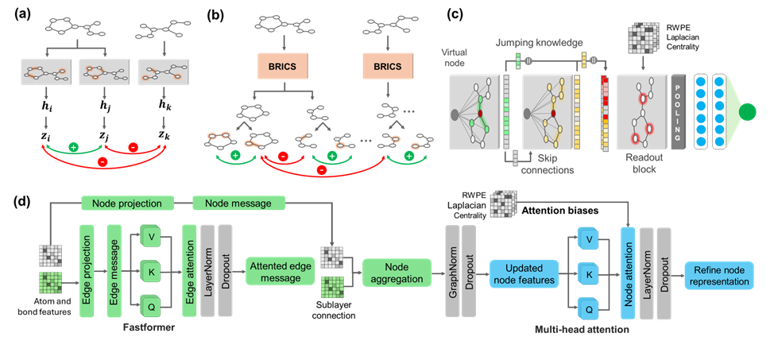

# Instance-Wise Contrastive Graph Neural Network for Discovery of Novel Aedes aegypti Larvicidal Compounds



## Overview
The codebase keeps the supervised multitask molecular learning pipeline and the MPNN encoder built around:

- Jumping Knowledge aggregation
- Virtual nodes for graph-level information exchange
- Residual message-passing updates
- Optional auxiliary contrastive losses during supervised training


## Environment Installation
Run the following commands in the terminal:

```bash
conda create --name graph python=3.9
conda activate graph
pip install torch==2.5.1 --index-url https://download.pytorch.org/whl/cu118
pip install -r requirements.txt
```

## Laboratory of Cheminformatics
Faculty of Pharmacy
Federal University of Goias (UFG)
Brazil
